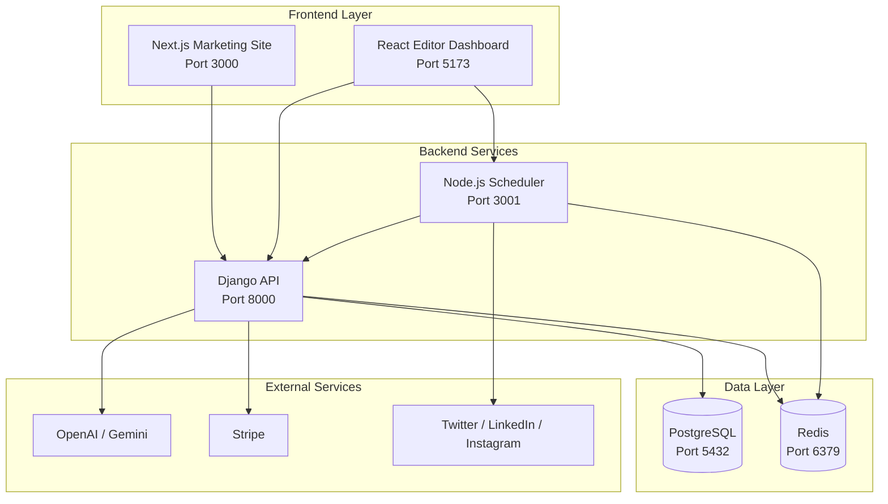

# AI-Powered Content-as-a-Service (CaaS) Platform

[](https://opensource.org/licenses/MIT)

Production-grade, multi-service SaaS platform for AI-powered social media content generation and scheduling.

## 🎯 Overview

CaaS is a full-stack platform that allows users to:
- ✨ Generate AI-powered social media content (Twitter, LinkedIn, Instagram)
- ✏️ Edit content using a rich drag-and-drop editor
- 📅 Schedule posts across multiple platforms
- 🎨 Showcase content in public portfolios
- 💳 Subscribe to paid plans with Stripe integration

Built with enterprise-grade architecture:  production-ready, scalable, and interview-ready.

## 🏗️ System Architecture



## 📁 Project Structure

```
caas/
├── caas-backend/          # Django REST API (Python)
│   ├── apps/
│   │   ├── users/        # Authentication & profiles
│   │   ├── organizations/ # Multi-tenancy & RBAC
│   │   ├── content/      # AI generation & versioning
│   │   ├── subscriptions/ # Stripe billing
│   │   └── scheduling/   # Post scheduling metadata
│   └── README.md
│
├── caas-scheduler/        # Node.js Scheduler (TypeScript)
│   ├── src/
│   │   ├── queues/       # BullMQ job processing
│   │   ├── services/
│   │   │   └── platforms/ # Twitter, LinkedIn, Instagram
│   │   └── routes/       # REST API
│   └── README.md
│
├── caas-editor/           # React Editor (TypeScript)
│   ├── src/
│   │   ├── components/   # UI components
│   │   ├── hooks/        # TanStack Query hooks
│   │   └── api/          # API clients
│   └── README.md
│
├── caas-marketing/        # Next.js Marketing Site
│   ├── src/app/          # App Router pages
│   ├── components/       # Landing, pricing, blog
│   └── README.md
│
├── docker-compose.yml     # Local development setup
└── README.md              # This file
```

## 🚀 Quick Start

### Prerequisites

- **Docker** & **Docker Compose** (recommended)
- OR manually: Python 3.11+, Node.js 18+, PostgreSQL 15+, Redis 7+

### Option 1: Docker Compose (Recommended)

```bash
# Clone the repository
git clone <repo-url>
cd caas

# Copy environment files
cp caas-backend/.env.example caas-backend/.env
cp caas-scheduler/.env.example caas-scheduler/.env

# Edit .env files with your API keys (see Configuration section)

# Start all services
docker-compose up

# In another terminal, run Django migrations
docker-compose exec django python manage.py migrate
docker-compose exec django python manage.py createsuperuser
```

Services will be available at:
- 🌐 Django API: http://localhost:8000
- 🛠️ Scheduler: http://localhost:3001
- 💻 Editor: http://localhost:5173
- 📱 Marketing: http://localhost:3000

### Option 2: Manual Setup

See individual service READMEs:
- [Django Backend](./caas-backend/README.md)
- [Node.js Scheduler](./caas-scheduler/README.md)
- [React Editor](./caas-editor/README.md)
- [Next.js Marketing](./caas-marketing/README.md)

## ⚙️ Configuration

### Required API Keys

**AI Providers** (at least one):
- OpenAI: https://platform.openai.com/api-keys
- Google Gemini: https://ai.google.dev/

**Stripe** (for billing):
- https://dashboard.stripe.com/apikeys

**Social Platforms** (optional for MVP):
- Twitter API: https://developer.twitter.com/
- LinkedIn API: https://www.linkedin.com/developers/

### Environment Variables Summary

See `.env.example` files in each service for complete configuration.

**Django (`caas-backend/.env`)**:
```bash
SECRET_KEY=your-secret-key
DATABASE_URL=postgresql://...
OPENAI_API_KEY=sk-...
STRIPE_SECRET_KEY=sk_test_...
```

**Node.js (`caas-scheduler/.env`)**:
```bash
REDIS_URL=redis://localhost:6379
JWT_SECRET=shared-with-django
TWITTER_BEARER_TOKEN=...
```

## 🎯 Key Features

### 1. AI Content Generation
- **Multi-provider support**: OpenAI GPT-4 & Google Gemini
- **Platform optimization**: Twitter (280 chars), LinkedIn (1300), Instagram (2200)
- **Tone selection**: Professional, Casual, Humorous, Inspirational, Educational
- **Version history**: Track and compare content iterations
- **Token tracking**: Quota management per subscription tier

### 2. Social Media Scheduling
- **Delayed scheduling**: Precise timing with BullMQ
- **Multi-platform**: Twitter/X, LinkedIn, Instagram
- **Retry logic**: Exponential backoff for transient failures
- **OAuth management**: Secure token handling per platform

### 3. Subscription & Billing
- **Stripe integration**: Checkout, webhooks, subscription lifecycle
- **Three tiers**: Free (100 tokens/mo), Pro ($29, 5K tokens), Team ($99, 20K tokens)
- **Usage tracking**: Real-time token consumption
- **Feature gating**: Tier-based access control

### 4. Multi-Tenancy
- **Organizations**: Team workspaces with RBAC
- **Roles**: Owner, Admin, Member, Viewer
- **Workspaces**: Content organization within teams

## 📡 API Documentation

### Interactive Documentation
- **Swagger UI**: http://localhost:8000/api/schema/swagger-ui/
- **OpenAPI Schema**: http://localhost:8000/api/schema/

### Example: Generate Content

```bash
curl -X POST http://localhost:8000/api/v1/content/generate/ \
  -H "Authorization: Bearer <jwt_token>" \
  -H "Content-Type: application/json" \
  -d '{
    "platform": "twitter",
    "tone": "professional",
    "prompt": "Announce our new AI-powered content platform",
    "organization_id": "uuid",
    "ai_provider": "openai"
  }'
```

## 🧪 Testing

```bash
# Django tests
cd caas-backend
pytest

# Node.js tests
cd caas-scheduler
npm test

# React tests
cd caas-editor
npm test
```

## 🚀 Deployment

### Production Checklist

- [ ] Set all `DEBUG=False` / `NODE_ENV=production`
- [ ] Use strong secret keys (JWT_SECRET, SECRET_KEY)
- [ ] Switch Stripe to production mode
- [ ] Configure ALLOWED_HOSTS and CORS
- [ ] Set up HTTPS/SSL
- [ ] Use managed PostgreSQL (AWS RDS, DigitalOcean, etc.)
- [ ] Use managed Redis (Redis Cloud, AWS ElastiCache)
- [ ] Set up error tracking (Sentry)
- [ ] Configure CDN for static assets
- [ ] Set up monitoring (DataDog, New Relic)

### Deployment Platforms

**Recommended Stacks**:
- **Render**: Easy deployment, managed PostgreSQL/Redis
- **Railway**: Great DX, simple setup
- **AWS**: ECS + RDS + ElastiCache (production scale)
- **Digital Ocean**: App Platform + Managed Databases

## 🔐 Security Features

- ✅ JWT authentication with short-lived tokens (15 min)
- ✅ Stripe webhook signature verification
- ✅ Rate limiting per subscription tier
- ✅ CORS configuration
- ✅ HTTPS-only in production
- ✅ SQL injection protection (Django ORM)
- ✅ XSS protection (React + DOMPurify)
- ✅ CSRF protection

## 🏆 Architecture Highlights

### Why Django + Node.js Hybrid?

**Django strengths**:
- Mature ORM for complex business logic
- Built-in admin panel
- Strong auth & permissions ecosystem
- Excellent for transactional operations

**Node.js strengths**:
- Superior I/O performance for API calls
- Native async/await for concurrency
- BullMQ reliability > Celery
- Lower latency for real-time features

**Result**: Each service scales independently based on workload characteristics.

### Scalability Considerations

- **Stateless services**: Easy horizontal scaling
- **Queue-based async**: Prevents thundering herd on social APIs
- **Database read replicas**: Separate analytics queries
- **Redis caching**: Reduce database load
- **CDN for frontends**: Global low-latency access

## 📚 Technology Stack

| Layer | Technologies |
|-------|-------------|
| **Frontend** | React, Next.js, TypeScript, Tailwind CSS, TanStack Query |
| **Backend** | Django, Node.js, Express, Python 3.11, TypeScript |
| **Databases** | PostgreSQL 15, Redis 7 |
| **Queues** | BullMQ |
| **AI** | OpenAI GPT-4, Google Gemini |
| **Payments** | Stripe |
| **Social APIs** | Twitter API v2, LinkedIn API, Instagram Graph API |
| **DevOps** | Docker, Docker Compose, Nginx |

## 🐛 Troubleshooting

### Common Issues

**"Connection refused" errors**:
```bash
# Check all services are running
docker-compose ps

# Check logs
docker-compose logs django
docker-compose logs scheduler
```

**Database migration errors**:
```bash
docker-compose exec django python manage.py migrate --run-syncdb
```

**Redis connection issues**:
```bash
# Test Redis
docker-compose exec redis redis-cli ping
# Should return: PONG
```

## 📖 Documentation

- [Django Backend README](./caas-backend/README.md)
- [Node.js Scheduler README](./caas-scheduler/README.md)
- [React Editor README](./caas-editor/README.md) *(coming)*
- [Next.js Marketing README](./caas-marketing/README.md) *(coming)*

## 🤝 Contributing

This is a demonstration project. For production use, consider:
- Implementing comprehensive test coverage (>80%)
- Adding end-to-end tests (Playwright/Cypress)
- Setting up CI/CD pipelines
- Implementing proper logging and monitoring
- Adding feature flags
- Implementing proper OAuth flows for social platforms

## 📄 License

MIT License - See LICENSE file for details

## 👤 Author

**CaaS Platform Team**

Built as a production-grade demonstration of:
- Microservices architecture
- AI integration (OpenAI/Gemini)
- Payment processing (Stripe)
- Social media APIs
- Modern web development practices

---

**⭐ Star this repo if you found it helpful!**
