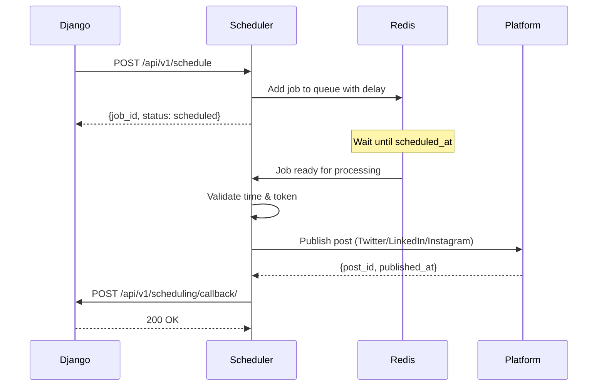

# CaaS Scheduler - Node.js Microservice

High-performance async scheduler service for social media post scheduling using Node.js, Express, and BullMQ.

## 🏗️ Architecture

This Node.js service handles:
- **Async Job Processing** (BullMQ + Redis)
- **Social Platform Publishing** (Twitter, LinkedIn, Instagram)
- **Scheduling Logic** (Delayed jobs with exponential backoff)
- **OAuth Token Management** (Platform-specific authentication)
- **Django API Communication** (Job status callbacks)

## 📁 Project Structure

```
caas-scheduler/
├── src/
│   ├── index.ts                  # Express server entry point
│   ├── config/
│   │   └── redis.ts             # Redis connection
│   ├── queues/
│   │   ├── scheduler.queue.ts   # BullMQ queue setup
│   │   └── processor.ts         # Job processing logic
│   ├── services/
│   │   ├── django-client.ts     # Django API HTTP client
│   │   └── platforms/
│   │       ├── base.platform.ts      # Abstract adapter
│   │       ├── twitter.platform.ts   # Twitter API
│   │       ├── linkedin.platform.ts  # LinkedIn API
│   │       └── instagram.platform.ts # Instagram (mock)
│   ├── routes/
│   │   └── schedule.routes.ts   # REST API endpoints
│   ├── middleware/
│   │   └── auth.middleware.ts   # JWT verification
│   └── types/
│       └── index.ts             # TypeScript types
├── package.json
├── tsconfig.json
└── .env.example
```

## 🚀 Quick Start

### 1. Prerequisites

- Node.js 18+
- Redis 7+
- Django backend running (for callbacks)

### 2. Setup

```bash
# Install dependencies
npm install

# Copy environment file
cp .env.example .env

# Edit .env with your credentials
```

### 3. Run Development Server

```bash
# Make sure Redis is running
redis-server

# Start in development mode (with hot reload)
npm run dev
```

Server runs at `http://localhost:3001`

## ⚙️ Configuration

### Required Environment Variables

```bash
# Server
PORT=3001
NODE_ENV=development

# Redis
REDIS_URL=redis://localhost:6379

# Django API
DJANGO_API_URL=http://localhost:8000
JWT_SECRET=your-jwt-secret-shared-with-django
SERVICE_TOKEN=shared-service-secret-token

# Twitter/X API
TWITTER_BEARER_TOKEN=your_twitter_bearer_token
TWITTER_CLIENT_ID=your_client_id
TWITTER_CLIENT_SECRET=your_client_secret

# LinkedIn API
LINKEDIN_CLIENT_ID=your_client_id
LINKEDIN_CLIENT_SECRET=your_client_secret

# Job Processing
MAX_CONCURRENT_JOBS=10
JOB_RETRY_ATTEMPTS=3
JOB_RETRY_DELAY=60000  # 1 minute in milliseconds
```

## 📡 API Endpoints

### Schedule a Post
```http
POST /api/v1/schedule
Authorization: Bearer <jwt_token>
Content-Type: application/json

{
  "content_id": "uuid",
  "platform": "twitter",
  "scheduled_at": "2026-02-15T10:00:00Z",
  "user_id": "uuid",
  "org_id": "uuid",
  "access_token": "platform_oauth_token"
}

Response:
{
  "job_id": "bull_job_id",
  "status": "scheduled",
  "scheduled_at": "2026-02-15T10:00:00Z"
}
```

### Get Job Status
```http
GET /api/v1/schedule/:jobId
Authorization: Bearer <jwt_token>

Response:
{
  "job_id": "123",
  "status": "completed",
  "progress": 100,
  "data": {...},
  "return_value": {...}
}
```

### Cancel Job
```http
DELETE /api/v1/schedule/:jobId
Authorization: Bearer <jwt_token>

Response:
{
  "message": "Job canceled successfully",
  "job_id": "123"
}
```

### Health Check
```http
GET /api/v1/health

Response:
{
  "status": "healthy",
  "service": "scheduler",
  "queue": {
    "waiting": 5,
    "active": 2,
    "completed": 150,
    "failed": 3
  }
}
```

## 🔄 Job Processing Flow



## 🎯 Key Features

### BullMQ Job Queue
- **Delayed jobs** with precise timing
- **Retry logic** with exponential backoff (3 attempts)
- **Concurrency control** (configurable via MAX_CONCURRENT_JOBS)
- **Job persistence** (survives Redis crashes)
- **Priority queuing** (future enhancement)

### Platform Adapters

Each platform implements the `BasePlatformAdapter` interface:

```typescript
interface BasePlatformAdapter {
  publishPost(text: string, accessToken: string): Promise<JobResult>;
  validateToken(accessToken: string): Promise<boolean>;
}
```

**Twitter**: Uses Twitter API v2 (`twitter-api-v2` package)
**LinkedIn**: Uses LinkedIn UGC Posts API
**Instagram**: Mock implementation (requires Facebook Business approval)

### Error Handling
- **Transient errors**: Automatic retry with backoff
- **Permanent errors**: Immediate failure with callback
- **Token expiration**: Validation before publishing
- **Rate limiting**: Respects platform limits (future enhancement)

## 🧪 Testing

```bash
# Run tests
npm test

# Watch mode
npm test -- --watch

# Coverage
npm test -- --coverage
```

## 📊 Monitoring

### Queue Metrics

Access queue stats via health endpoint:
```bash
curl http://localhost:3001/api/v1/health
```

### BullMQ Board (Optional)

Install BullMQ Board for visual monitoring:
```bash
npm install -g @bull-board/api @bull-board/express
```

## 🔐 Security

- **JWT Authentication**: Verifies tokens from Django
- **Service Token**: Additional layer for service-to-service calls
- **Helmet**: Security headers
- **CORS**: Configured for allowed origins
- **Rate Limiting**: TODO - implement per-user rate limits

## 🚀 Production Deployment

### Build for Production

```bash
# Compile TypeScript
npm run build

# Run compiled code
npm start
```

### Using PM2

```bash
# Install PM2
npm install -g pm2

# Start service
pm2 start dist/index.js --name caas-scheduler

# Monitor
pm2 monit

# Restart
pm2 restart caas-scheduler

# Logs
pm2 logs caas-scheduler
```

### Docker Deployment

```dockerfile
FROM node:18-alpine

WORKDIR /app

COPY package*.json ./
RUN npm ci --only=production

COPY dist/ ./dist/

ENV NODE_ENV=production

CMD ["node", "dist/index.js"]
```

Build and run:
```bash
docker build -t caas-scheduler .
docker run -p 3001:3001 --env-file .env caas-scheduler
```

## 🔧 Development Commands

```bash
# Install dependencies
npm install

# Run in dev mode (hot reload)
npm run dev

# Build TypeScript
npm run build

# Lint code
npm run lint

# Format code
npm run format

# Type check
tsc --noEmit
```

## 🐛 Troubleshooting

### Common Issues

**Redis connection errors:**
```bash
# Check Redis is running
redis-cli ping

# Should return: PONG

# Check Redis URL in .env
REDIS_URL=redis://localhost:6379
```

**Jobs not processing:**
```bash
# Check worker is running
# Look for log: "✅ Redis connected successfully"

# Check queue health
curl http://localhost:3001/api/v1/health

# Inspect Redis queues
redis-cli
> KEYS bull:social-posts:*
```

**Twitter API errors:**
- Verify `TWITTER_BEARER_TOKEN` is set
- Check API rate limits (900 requests per 15-min window)
- Ensure Twitter developer account is approved

**LinkedIn API errors:**
- Verify OAuth token has `w_member_social` scope
- Check token expiration (60 days)
- Ensure user has granted permissions

## 🏆 Interview Talking Points

### Why Node.js for Scheduler?
- **Superior I/O performance** for network-heavy operations (API calls)
- **Native async/await** for concurrent job processing
- **BullMQ maturity** beats Python Celery for reliability
- **Lower latency** for real-time scheduling needs

### Architecture Decisions
- **BullMQ over Celery**: Better Redis integration, built-in UI, TypeScript support
- **Platform adapters**: Abstract interface allows easy addition of new platforms
- **Callback pattern**: Django remains source of truth for job status
- **Stateless workers**: Easy horizontal scaling

### Scalability
- **Horizontal scaling**: Add more Node.js workers pointing to same Redis
- **Queue partitioning**: Separate queues per platform for isolation
- **Circuit breakers**: Prevent cascading failures (future enhancement)
- **Graceful degradation**: Mock Instagram prevents entire system blocking

### Trade-offs
- **Complexity**: Two services (Django + Node) vs monolith
- **Network overhead**: Extra HTTP call for callbacks
- **Consistency**: Eventual consistency between services
- **Debugging**: Distributed tracing needed in production

---

**License**: MIT
**Maintainer**: CaaS Platform Team
